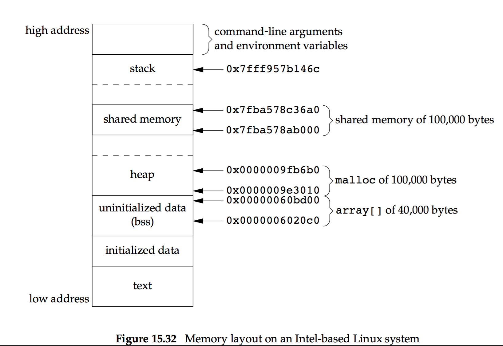

# Interprocess Communication

**Old trick**: Passing open files across a `fork` or an `exec` or through the file system.

**New trick**: IPC.

**IPC types**: Pipes, FIFOs, message queues, semaphores, shared memory, message queues, sockets, STREAMS.

## Pipes
> Half-duplex: Data flows in only one direction

Limitations:

1. Half-duplex
2. Used only between processes sharing a common ancestor by `fork`.

FIFOs get around the second limitation, and UNIX domain sockets get around both.

```c
#include <unistd.h>

int pipe(int fd[2]); // return 0 on ok, -1 on error
```

`fd[0]` is open for reading, and `fd[1]` is open for writing. They are *returned value*.

However, the original `pipe` interface is too primitive, thus we have below:

```c
#include <stdio.h>
FILE *popen(const char *cmdstring, const char *type);

int pclose(FILE *fp);
```

The function `popen` does a `fork` and `exec` to execute the `cmdstring` and returns a standard I/O file pointer. If `type` is "r", the file pointer is connected to the standard output of `cmdstring`. If `type` is "w", the file pointer is connected to the standard input of `cmdstring`.

The `pclose` function closes the standard I/O stream, waits for the command to terminate, and returns the termination status of the shell.


Think about UNIX filter. A filter becomes a *coprocess* when the same program generates the filter's input and read filter's output.

## FIFOs
FIFOs are also called "named pipes". With it, unrelated processes can exchange data.

And FIFO is a type of file, and it has a path as well.

```c
#include <sys/stat.h>

int mkfifo(const char *path, mode_t mode);
int mkfifoat(int fd, const char *path, mode_t mode);
```

The `mode` is same as for `open`. The `mkfifoat` can be used to create a FIFO in a location relative to the directory represented by the `fd` file descriptor argument.


Once FIFO is created, we open it using `open`. And normal I/O functions (e.g., `close`, `read`, `write`, `unlink`) all work with FIFOs.

Two uses of FIFOs:

1. Used by shell commands to pass data from one shell pipeline to another without creating intermediate temporary files
2. Used as rendezvous points in client-server applications

> FIFO has a name, so it can be used for nonlinear connections.

## XSI IPC

### Identifiers and Keys

Each *IPC structure* (mq, sem, sm) in the kernel is referred to by a non-negative integer *identifier*. It is a internal name, so the cooperating processes need an external name associated with *IPC object*, which is called *key*.


Various ways for a client and a server to rendezvous at the same IPC structure:

1. By `IPC_PRIVATE`
2. By defining the key in a common header
3. By agreeing on a pathname and project ID and call function `ftok` to convert them into key

Three `get` functions: `msgget`, `semget`, `shmget`. They all have two arguments `key` and `flag`. Several things to consider:

1. Do we want to create a new construct or refer to the existing one?
2. How do we identify the existing object -- by identifier or key?

### Permission Structure

```c
   struct ipc_perm {
     uid_t  uid;  /* owner’s effective user ID */
     gid_t  gid;  /* owner’s effective group ID */
     uid_t  cuid; /* creator’s effective user ID */
     gid_t  cgid; /* creator’s effective group ID */
     mode_t mode; /* access modes */
   };
```

The permissions can be changed with `msgctl`, `semctl` or `shmctl`.

### Pros & Cons
Cons:

* Used systemwide without reference count
* Not known by names in file system
* Can't use the multiplexed I/O functions

Pros:

* Reliable
* Flow controlled
* record ortiented

### Message Queues
MQ is a linked list of messages. A new one is created with or an existing queue is opened by `msgget`. New message is appended with `msgsnd`. Message is fetched by receiver with `msgrcv`, based on the type field but not in FIFO order.

```c
#include <sys/msg.h>

int msgget(key_t key, int flag);
int msgctl(int msqid, int cmd, struct msqid_ds *buf);
int msgsnd(int msqid, const void *ptr, size_t nbytes, int flag);
```

The `cmd`: `IPC_STAT`, `IPC_SET`, `IPC_RMID`

Each MQ has a `msqid_ds` struct with it, which records information about permission, number of messages, et cetera. 

### Semaphores
A semaphore is a counter used to provide access to a shared data object for multiple processes. The values of semaphore is related to how many resources are available for sharing.

Problems:

1. Semaphore is a set of values
2. The creation (`semget`) is independent of its initialization (`semctl`).
3. The existence of semaphore doesn't depend on processes, so a program might terminate without releasing the allocated semaphores.

```c
#include <sys/sem.h>

int semget(ket_t key, int nsems, int flag);
int semctl(int semid, int semnum, int cmd, ...  /* union semun arg */);
int semop(int semid, struct sembuf semoparray[], size_t nops);
```

`nsems` is the number of semaphores.


The `semop` atomically performs an array of operations on a semaphore set.

### Shared Memory
The only trick in using shared memory is *synchronizing access* to a given region among multiple processes. And semaphores, mutexes or record locking are often used for such purpose.

```c
#include <sys/shm.h>

int shmget(key_t key, size_t size, int flag);
int shmctl(int shmid, int cmd, struct shmid_ds *buf);
void *shmat(int shmid, const void *addr, int flag);
int shmdt(const void *addr);
```

Once a shared memory segment has been created, a process attaches it to its address space by calling `shmat`.

When we are done with a shm segment, we call `shmdt` to detach it.



### Client-Server Properties
* **Open server**: Server process opens files for the client. So the permissions are more flexible.
* **Daemon process**: The process will be contacted using some named IPC by all clients.

> The server should require the client to create the IPC structure and have the client set the access permissions to user-read and user-write only. The times associated with the IPC structure should also be verified by the server to be recent.


## Exercises
### 15.1 
If the write end of the pipe is never closed, the reader never sees an end of file. The pager program blocks forever reading from its standard input.

### 15.2
The parent terminates right after writing the last line to the pipe. The read end will be automatically closed. In shell, the terminal mode will be changed and interferes with the paper program, which has also modified the terminal mode.

### 15.3
A file pointer will be returned. But shell can't execute and print error.

### 15.4
Looks at process's termination status.

### 15.5
To do this, we first need to adjust the buffering, then after changing `fputs` into `printf`, we must use `fflush` as well.

### 15.6
If call `wait`, the first child to terminate is child generated by `popen`, which is not created by `system`, so continue to wait. When `pclose` calls `wait`, an error is returned.

### 15.7
`select` would indicate that the descriptor is readable. `read` returns 0. For `poll`, `POLLHUP` even is returned. 

### 15.8
Anything written by the child to stderr appears wherever parent's stderr would appear.

### 15.9
When `cmdstring` terminates, the shell is waiting for this. The shell then exists.

### 15.10
The trick is to open the FIFO twice.

### 15.11
Identifier for the queue and the queue allowing world-read access.

### 15.13
We never store actual addresses in a shared memory segment, instead we store offsets to other objects in the shared memory segment.

> 15.15 ~ 18 is all "redo the program", which is too boring ......


