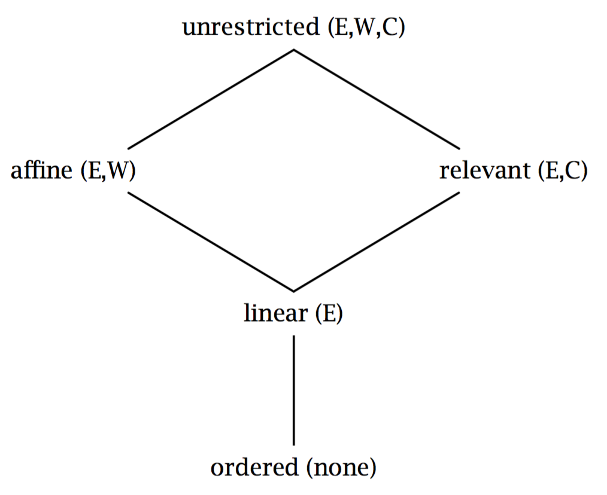
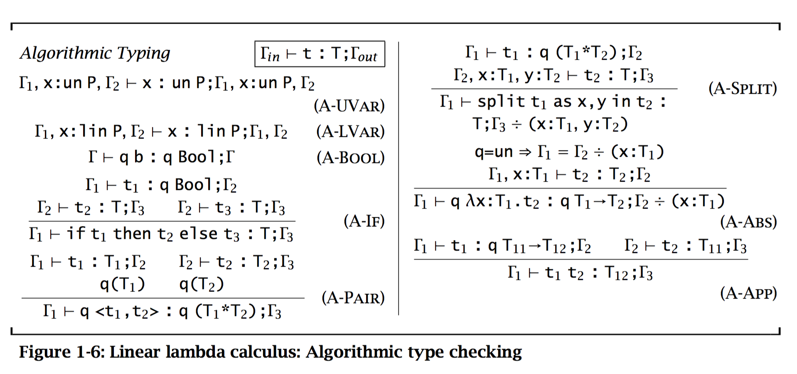
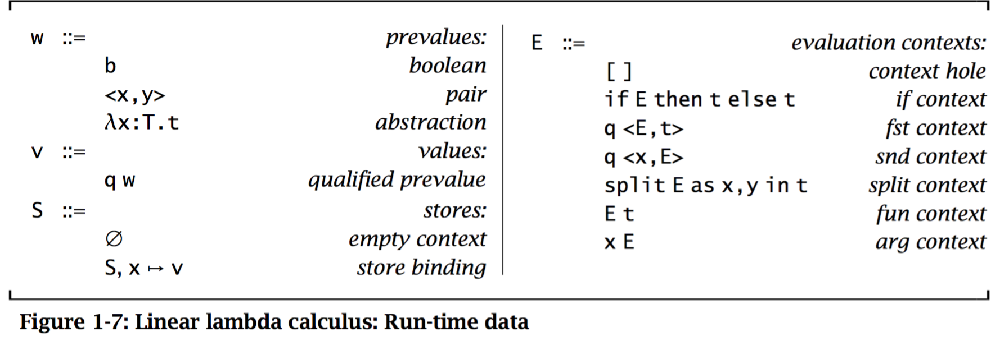
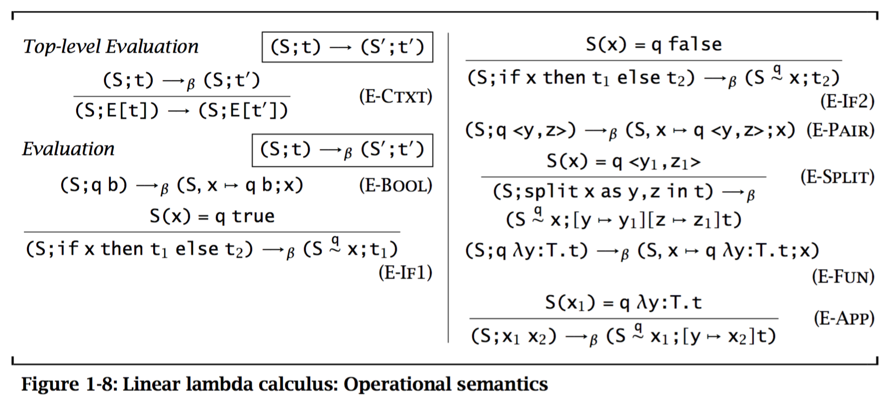
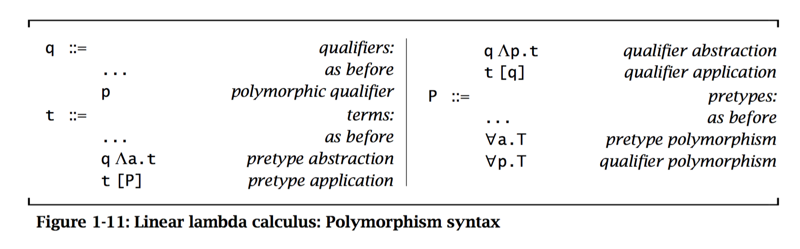
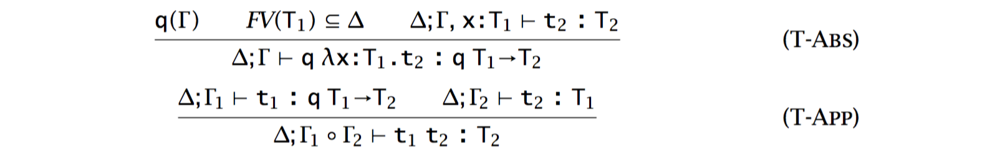
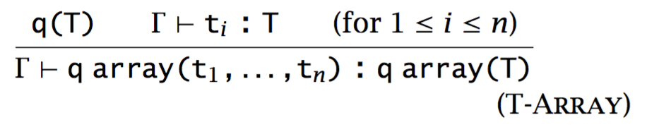
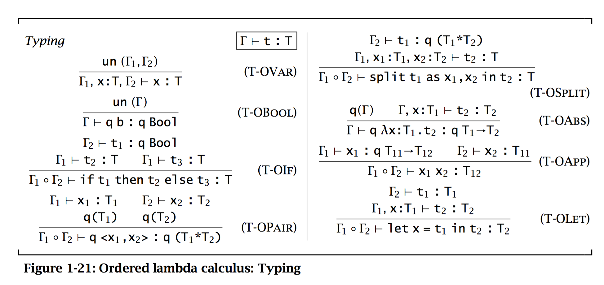

# Substructural Types
Substructural type system: arguments standard type abstraction mechanisms with the ability to control the **number and order of uses** of a data structure or operation.

## Structural Properties
1. *Exchange*: $$\Gamma_1, x_1:T_1, x_2:T_2 \vdash t:T \Leftrightarrow \Gamma_1, x_2:T_2, x_1:T_1 \vdash t:T$$
2. *Weakening*: $$\Gamma_1, \Gamma_2 \vdash t : T \Rightarrow \Gamma_1, x_1:T_1, \Gamma_2 \vdash t : T$$
3. *Contraction*: $$\Gamma_1, x_2:T_1, x_3:T_1, \Gamma_2 \vdash t:T_2 \Rightarrow \Gamma_1, x_1:T_1, \Gamma_2 \vdash [x_2 \mapsto x_1][x_3 \mapsto x_1]\,t:T_2$$

As a result, a *substructural type system* is any type system designed in which one or more of the structural properties do not hold.

* **Linear** type systems ensure that every variable is *used exactly once* by allowing exchange but not weakening or contraction.
* **Affine** type systems ensure that every variable is used *at most once* by allowing exchange and weakening, but not contraction.
* **Relevant** type systems ensure that every variable is used *at least once* by allowing exchange and contraction, but not weakening.
* **Ordered** type systems ensure that every variable is used *exactly once and in the order* in which it is introduced by not allowing any of the structural properties.



## Linear TS
Problem: Allocation & Deallocation

Two invariants:

1. Linear variables are used exactly once along every control-flow path.
2. Unrestricted data structures may not contain linear data structures. More generally, data structures with less restrictive type may not contain data structures with more restrictive type.


We maintain the first invariant through **context management**. We split the linear variables between the different subterms to ensure each variable is used exactly once.

$$
\frac{\Gamma = \Gamma_1 \circ \Gamma_2}{
    \Gamma, x:lin\,P = (\Gamma_1, x:lin\,P) \circ \Gamma_2
} \text{M-Lin1}
$$
$$
\frac{\Gamma = \Gamma_1 \circ \Gamma_2}{
    \Gamma, x:lin\,P = \Gamma_1 \circ (\Gamma_2, x:lin\,P)
} \text{M-Lin2}
$$

To check the second invariant, we define the predicate $q(T)$ (and its extension to contexts $q(\Gamma)$) to express the types $T$ that can appear in a $q$-qualified data structure.

* $q(T)$ if and only if $T=q'(P)$ and $q \sqsubseteq q'$
* $q(\Gamma)$ if and only if $\forall x:T \in \Gamma, q(T)$

**NOTE:** these rules are constructed anticipating a call-by-value operational semantics.

To avoid the non-deterministic problem introduces by splitting, we can have a algorithmic version of typing rules:



There, we introduced a "context difference" operator ($\div$)

$$\Gamma \div \emptyset = \Gamma $$

$$\frac{\Gamma_1 \div \Gamma_2 = \Gamma_3 \quad (x : lin \, P) \notin \Gamma_3}{ \Gamma_1 \div (\Gamma_2, x : lin \, P) = \Gamma_3}$$

$$\frac{\Gamma_1 \div \Gamma_2 = \Gamma_3 \quad \Gamma_3 = \Gamma_4, x : un \, P,\Gamma_5}{ \Gamma_1 \div (\Gamma_2, x : un \, P) = \Gamma_4, \Gamma_5}$$

Here, some properties are listed. $\mathcal L(\Gamma)$ and $\mathcal U(\Gamma)$ is correspondingly about linear and unrestricted assumptions in $\Gamma$ perspective.

Lemmas:

* Algorithmic monotonicity: If $\Gamma \vdash t :T; \Gamma'$, then $\mathcal U(\Gamma') = \mathcal U(\Gamma)$ and $\mathcal L(\Gamma') \subseteq \mathcal L(\Gamma)$
* Algorithmic exchange: If $\Gamma_1, x_1 : T_1, x_2 : T_2, \Gamma_2 \vdash t: T; \Gamma_3$ then $\Gamma_1, x_2 : T_2, x_1 : T_1, \Gamma_2 \vdash t: T; \Gamma_3'$, in which $\Gamma_3$ and $\Gamma_3'$ is the same up to transposition of the bindinds for $x_1$ and $x_2$.
* Algorithmic weakening: If $\Gamma \vdash t : T; \Gamma'$ then $\Gamma, x:T' \vdash t: T; \Gamma', x: T'$
* Algorithmic strengthening: If $\Gamma, x : lin \, P \vdash t: T; \Gamma', x : lin \, P$ then $\Gamma \vdash t : T; \Gamma'$.


### Operational Semantics
To make the memory management properties clear, we will evaluate terms in an abstract machine with an explicit store.

The operation of abstract machine is defined using a context-based, small-step semantics.



Context, represented with $E$, are terms with a single hole. Contexts define the order of evaluation of terms -- the places in a term where a computation can occur. And in the above definition, the order is left-to-right since $E \, t$ means $E$ in the function position so the function term can be firstly reduced. While $x \, E$ indicates that if the term in argument position $E$ is to be reduced, then the function position must have a pointer.

Let's see the operational semantics:



Thus, we can prove the standard progress and preservation theorems.


## Extensions & Variations

Practical extensions to the simple linear lambda calculus

### Sum & Recursive Types
> *Standard introduction elimination forms*.

Injections: $q \, inl_P \, t$, $q \, inr_P \, t$, $P \triangleq T_1 + T_2$

Recursive: $roll_P \, t$, $P$ is the recursive *pretype* the expression will assume.

> Since the free variables in a recursive function closure will be used on each recursive invocation of the function, we cannot allow the closure to contain linear variables.

Example: linear list of `T`s: 

    type T llist = rec a. lin (unit + lin (T * lin a))

Fully unrestricted list:

    type T list = rec a. unit + T * a


Let's define the `map` for linear list:

    fun map(f: T1 -> T2, xs: T1 llist): T2 llist =
        case unroll xs of
            inl _  => nil()
            inr xs =>
                split xs as hd, tl in
                    cons(f hd, map lin <f, tl>)

Overhead: the `f hd` is accumulated on the stack in recursive calling.

> If the last operation in a function is itself a function call, then this *tail-call* can be eliminated, i.e., the current stack frame can be deallocated before calling the new function.

The new implementation:

```ocaml
fun map(f: T1 -> T2, input: T1 llist): T2 llist =
    reverse(mapRev(f, input, nil()), nil())

and mapRev(f: T1 -> T2,
           input: T1 llist,
           output: T2 llist): T2 llist =
    	case unroll input of
    	   inl _  => output
    	   inr xs =>
    	       split xs as hd, tl in
    	           mapRev (f, tl, cons(f hd, output)))

and reverse(input: T2 llist, output: T2 llist)
        case unroll input of
            inl _  => output
            inr xs =>
                split xs as hd, tl in
                    reverse(tl, cons(hd, output)))
```

### Polymorphism
* Poly over shape of data
* Poly over memory management of data (linear vs. unrestricted)
        
```   
type (p1, p2, a) list =
    rec a. p1 (unit + p1 (p2 a * (p1, p2, a) list))
```

**Observe**: `p2` is about a, while `p1` is about the structure. Here are two nested substructure `+` and `*`, and they both use `p1`. And here the way of qualifying is really explicit.




Now, the map is written like this:

    val map =
        Λa,b. Λ pa, pb.
        fun aux (f: (pa a -> pb b).
                 xs: (lin, pa, a) list)
                ) : (lin, pb, b) list =
            case unroll xs of
                inl _  => nil [b, pb] ()
                inr xs => split xs as hd, tl in
                            cons [b, pb] (pa < f hd
                                             , map(lin <f, tl>) >
                                         )
About correctness and typing rules

* Ensure that we *propagate contexts* containing abstract qualifiers safely through the other typing rules in the system. We can't risk duplicating unknown qualifiers which might turn out to be linear.
* Conservatively extend the relation on type qualifiers. $lin \sqsubseteq p \sqsubseteq un$.
* Type context $\Delta$: keep track of free type variables.



### Arrays
**Problem**: It is difficult to reflect the linearity of individual element in an array's type.

Possible solutions

* like tuple, which extracts all elements at the same time. *BAD SOLUTION*, since length of an array should be unknown at compiled time.
* Add a built-in iterator. *BAD SOLUTION*, since the merits of array, such as random-access, are sacrificed.

Solution: `swap(a[i], t)`. By *preserving* the number of pointers to the array and the number to each of its elements, there will be no changed to the array that needs to be reflected in the type system. `swap` replaced the $i^{th}$ element $t'$ of the array $a$ with $t$, and returns a pair containing the new array and $t'$. (**Note**: that make me think about reference counting).

We will have special syntax for array allocation, query length and reallocation.

> **Exercise 1.3.4**: The typing rule for array allocation (T-Array) contains the standard containment check to ensure that unrestricted arrays cannot contain linear objects. What kinds of errors can occur if this check is omitted?



Note that "T-Swap" rule. Only $q_1$ is specified. So, by swapping, the linear object will be swapped out, but becomes unrestricted.

SOLUTION: f an unrestricted array can contain a linear object, the linear object might never be used because the programmer might forget to use the entire array. Due to our swapping operational semantics for arrays, even though an unrestricted array (containing linear objects) can be used many times, the linear objects themselves can never be used more than once. In short, the supposedly linear objects would actually be affine.

### Reference Counting
New qualifier `rc`, explicit operation on count `inc` and `dec`. `inc` will turn one pointer into a linear pair of two copies, with pointed object's ref count incremented. `dec` will selectively the passed-in finalizer if the count is 1, and if not simply decrement the count.

> Linear typing will ensure the number of references to an object is properly preserved.

## An Ordered Type System
* Linear TS: Heap allocation
* Ordered TS: Stack allocation


**The idea**: By banning the exchange property, we can guarantee that certain values, those values allocated on the stack, are used in a first-in/last-out order.

Sequencing construct: $let \, x = t_1 \, in \, t_2$. It gives programmer explicit control over the order of evaluation of terms. (NOTE: Normal form?).

New qualifier `ord`: marks data allocated on the stack. *Functions can't be allocated on heap*.

> The first step in the development of the type system is to determine how assumptions will be used.

> The second step in the development of the type system is to determine the containment rules for ordered data structures.

> The third step in the development of the type system is to call the PhD student to type in LaTeX.
> 
> \-- Benjamin C. Pierce




**Example**: function taking a boolean and a pair allocated sequentially at the top of the stack. If the boolean is true, leave the pair the same; if false, it swaps them.

```ocaml
fun (x : ord (ord (int * int) * bool).
    split x as p, b in
        if b
            then p
            else
                split p as i1, i2 in
                    ord <i2, i2>    
```

**Exercise 1.4.1**: Write a program that demonstrates what can happen if the syntax of pair formation is changed to allow programmers to write nested subexpressions (i.e., we allow the term `ord <t1,t2>` rather than the term `ord <x,y>`).

The SOLUTION by Benjamin is a bit weird. He said it would be bad if typing rules are not changed.

```ocaml
let x = ord <true,true> in
let y = ord <ord <3,2>,x> in
split y as z1,z2 in
split z2 as b1,b2 in
if b1 then... (* using an int as if it was a bool *)
```

Stack: ..., \<true, true>, <<3, 2>, px>

`z2` is `ord <3, 2>`, it is not typed. So we can add another type rule, similar to

$$
    \frac{\Gamma_1 \vdash t_1 : T_1 \quad \Gamma_2 \vdash t_2 : T_2 \quad q(T_1) \quad q(T_2)}{\Gamma_1 \circ \Gamma_2 \vdash q \langle t_1, t_2 \rangle : q (T_1 * T_2)}
$$

> **Comment**: Is there anything special about what can we store on stack? Or *should* there be?

## Further Applications
### Controlling Temporal Resources
Problems:

1. Iterators can increase the size of their arguments, cause an exponential blow-up
2. HOF make it even easier

Solution: *Non-size-increasing* functions + preventing the construction of HOF.

1. Demand all user-defined objects to have *affine* types, which can be used zero or one time but no more.
2. Altering the `cons` constructor so it can only be applied when it has access to a special resource with type $R$. `operator cons : (R, T, T list) -> T list`

> The resource we acquire from destructing the list during iteration can be used to rebuild the list later.

```ocaml
val append : T list -> T list -> T list =
    iter of
        stop                => fun l : T list -> l
        hd with rest and r  => fun l : T list . cons (r, hd, rest l)
```

If with extra credits

```ocaml
val double : (T * R) list -> T list =
    iter of
        stop                => nil
        hd with rest and r1 =>
            split hd as x, r2 in cons(r1, hd, cons(r2, hd, rest))
```
### Compiler Optimization
Use usage information:

* Affine (use <= 1)
* Relevant (use >= 1)


GHC optimization:

#### Floating in bindings
`let x = e in (λy....x...)` becomes `λy.let x = e in (...x...)`. So we can avoid computing `e` and will not compute it more than once.

#### Inlining Expressions
* Used once: inline the expression
* No use: avoid computing at all

#### Thunk update avoidance
If the computed value will be used at most once, than the update can be avoided.

#### Eagerness
If some Haskell expression is used at least once, we can strictly evaluate it can avoid creating a thunk altogether.


