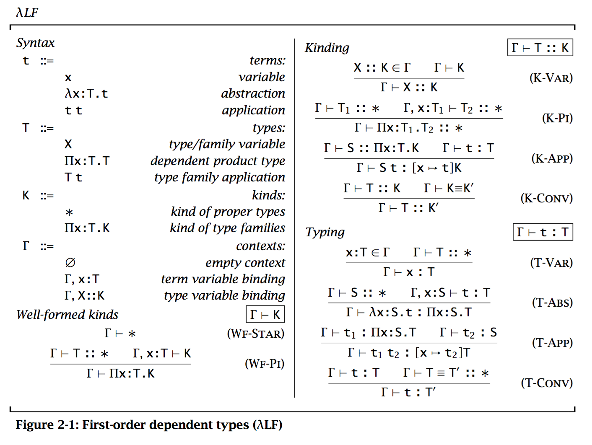

# Dependent Types

* General: Dependent types are type-valued functions.
* Specific: Functions that send *terms* to types.

## Motivations
Vectors

```
Vector :: Nat -> *
init : Pi n : Nat . data -> Vector n
cons : Pi n : Nat . data -> Vector n -> Vector (n + 1)
```
Here, the $\Pi x : S.T$, or `Pi x : S. T`, is called "Pi type". This type generalizes the **arrow type** of the simply typed lambda-calculus. It is the type of functions which map elements $s:S$ to elements of $[x \mapsto s]T$.


Note the *safe* `first`:

```
first : Pi n : Nat . Vector (n + 1) -> data
```

We can use $\Pi x: S.T$ to generalize the *function space* $S \rightarrow T$, if x doesn't appear free in $T$.

Here, the stressing of being free is essentially saying that $T$'s formation has no relationship with $x:S$. Those, it degenerates to the simply typed case.

Another example

```
sprintf : Pi f : Format. Data(f) -> String
-- in which
Data([])        = Unit
Data("%d"::cs)  = Nat * Data(cs)
Data("%s"::cs)  = String * Data(cs)
-- ...
```

### Curry-Howard correspondence

For example, $((A \rightarrow B) \rightarrow A) \rightarrow (A \rightarrow B) \rightarrow B$ is valid in *constructive logic*, and at the same time, is inhabited by term $\lambda f .\lambda u . u(f \, u)$.

If propositions are types, then proofs are terms.

        A =====> B
        |        |
       Prf A -> Prf B

CH-corres allows one to freely *mix propositions and PL types*.

```
ith : Pi n : Nat . Pi l : Nat . Lt(l, n) -> Vector(n) -> T
```

Here, `Lt(l, n)` is the *proposition* asserting that `l` is less then `n`.

Another example about the type of binary, associative operations on some type `T`:

```
Sigma m : T -> T -> T.
    Pi x : T.
        Pi y : T.
            Pi z : T.
                Id (m(x, m(y, z))) (m(m(x, y), z))
```

Here `Sigma m : A . B(x)` is the type of *pairs* where `a : A` and `b: B(a)`.

### Higher-Order Abstract Syntax
```
Ty :: *
Tm :: Ty -> *
base : Ty
arrow : Ty -> Ty -> Ty
app : Pi A : Ty . Pi B : Ty . Tm (arrow A B) -> Tm A -> Tm B
lam : Pi A : Ty . Pi B : Ty . (Tm A -> Tm B) -> Tm (arrow A B)
```

```
-- id on type A
idA = lam A A (\x : Tm A.x)

-- Church 2
two = \A:Ty. lam A (arrow (arrow A A) A)
        (\x:Tm A.lam _ _
                (\f:Tm (arrow A A).
                    app _ _ f (app _ _ f x)))
```

## Pure First-Order Dependent Types



Kinds allow us to distinguish between proper types of kind `*` and type families if kind `Pi x : T. K`.

Problem introduces by type equivalence:

* Whether or not typechecking is decidable

Martin-Löf: *definitional equality*.


