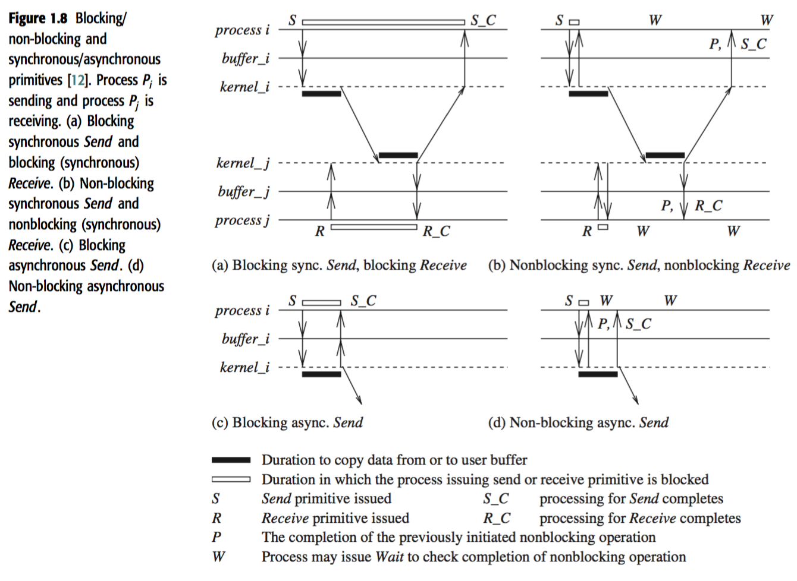
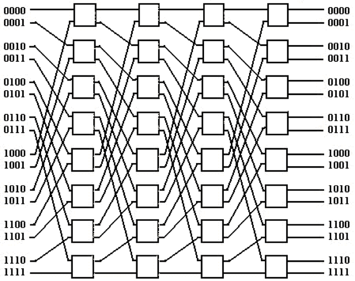
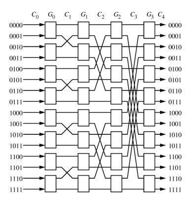
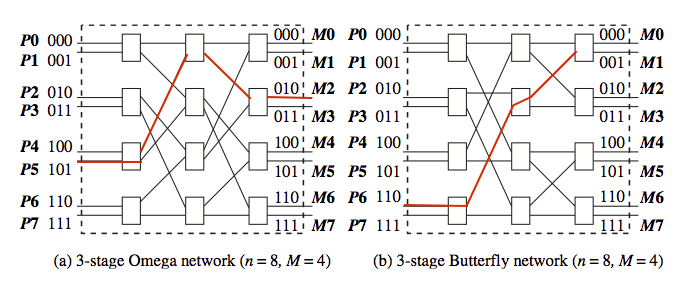
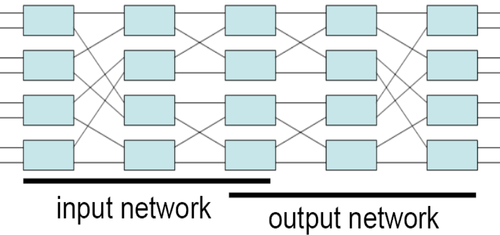
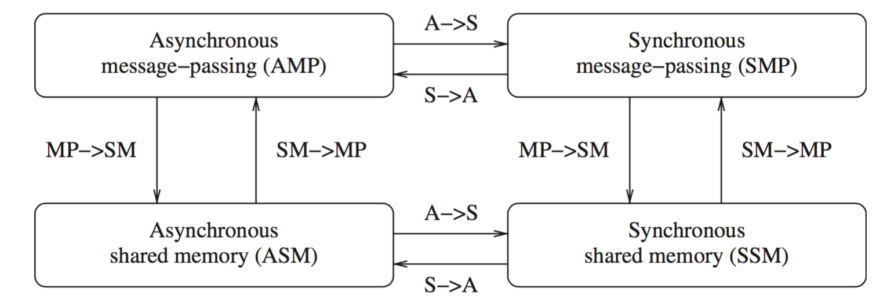

# Distributed - Intro

## Multi-Processor Interconnection
In the book, Omega and Butterfly are introduced. Their specific rules of connection are not easy to see, but following some general points:

1. What is "address"?
2. How many input and how many output?
3. How many stages?
4. When a signal arrives at certain stage's certain switch, what will happen?

## Definitions
* Parallelism or speedup of a program on a specific system: $$\frac{T(1)}{T(n)}$$
* Parallelism within a parallel/distributed program: $$\frac{T_{productive}}{T_{productive} + T_{waiting}}$$
* Concurrency of a program: $$\frac{N_{local}}{N_{local} + N_{shared}}$$
* Granularity of a program: $$\frac{N_{computation}}{N_{communication}}$$

+ **Network OS**: Run on loosely coupled processors, running loosely coupled software
+ **Distributed OS**: Run on loosely coupled processors, running tightly coupled software
+ **Multi-Processor OS**: Run on tightly coupled processors, running tightly coupled software

## Primitives
1. **Blocking**: Controls returns to the invoking process after the processing for the primitive completes
2. **Sync**: A `Send` or a `Receive` primitive is synchronous if both handshake with each other
3. **Async**: A `Send` is async if control returns back to the invoking process after the data item to be send has been copied out of *the user-specified buffer*
4. **Non-blocking**: Control returns after invoking immediately. A handle will be returned, which can be `check`ed or `wait`.

A nice picture:

*Sync* versus *async* executions:

1. Async:
    * No processor synchrony and no bound on the drift rate of processor clocks
    * Message delays are finite but unbounded
    * There is no upper bound on the time taken by a process to execute a step
2. Sync: Except for the above aspects, synchronous executions are also staged.

Emulating S → A is trivial, but A → S needs a *synchronizer*.

## Distributed systems challenges from a system perspective

* **Communication**: RPC, ROI, Message-Oriented, Stream-Oriented
* **Processes**: Process Management, Code Migration, Design of software and mobile agents
* **Naming**
* **Synchronization**: Mutual exclusion, leader election, clock synchronization, global state
* **Data storage and access**: Fast, Scalable, Distributed
* **Consistency and replication**: For faster access, we use replicas/caches. Example issue: deciding the level of granularity of data access.
* **Fault tolerance**: Process resilience, reliable communication, distributed commit, checkpointing and recovery, agreement and consensus, failure detection, and self-stabilization.
* **Security**: various aspects of cryptography, secure channels, access control, key management – generation and distribution, authorization, and secure group management.
* **Applications Programming Interface (API) and transparency**

## Algorithmic challenges in distributed computing

* Execution models:
    1. Interleaving
    2. Partial Order
    3. I/O automata
    4. TLA (temporal logic of actions)
* Efficient distributed graph algorithms is of paramount importance.
* Time and global state in a distributed system.
* Synchronization/coordination mechanisms.
* Group communication, multicast, and ordered message delivery.
* Monitoring distributed events and predicates
* Distributed program design and verification tools
* Debugging distributed programs
* Data replication, consistency models, and caching

## Exercise
#### What are the main differences between a parallel system and a distributed system?

* *Parallel system* is composed of multiple processors having access to shared memory, and executing simultaneously to finish some job
* *Distributed system* is composed of remotely distributed processors and its own databank, and they communicated mainly in a message-passing way through data links. There is less restrictions on how they should perform a computation together.

#### Identify some distributed applications in the scientific and commercial application areas. For each application, determine which of the motivating factors listed in Section 1.3 are important for building the application over a distributed system.
* Scientific: Cosmology@Home
    1. Inherently distributed
    2. Resource sharing: CPU time
* Commercial: HDFS
    1. Access
    2. Reliability
    3. Scalability
    4. Modularity and Expandability

#### Draw the Omega and Butterfly networks for n = 16 inputs and outputs.

Omega 16 x 16

Butterfly 16 x 16

#### For the Omega and Butterfly networks shown in Figure 1.4, trace the paths from P5 to M2, and from P6 to M1.


#### Formulate the interconnection function for the Omega network having n inputs and outputs, only in terms of the M = n/2 switch numbers in each stage. (Hint: Follow an approach similar to the Butterfly network formulation.)
= = I think formula 1.1 in the book works.

#### In Figure 1.4, observe that the paths from input 000 to output 111 and from input 101 to output 110 have a common edge. Therefore, simultaneous transmission over these paths is not possible; one path blocks another. Hence, the Omega and Butterfly networks are classified as blocking *interconnection networks*. Let $\Pi(n)$ be any permutation on $[0...n − 1]$, mapping the input domain to the output range. A non-blocking interconnection network allows simultaneous transmission from the inputs to the outputs for any permutation. Consider the network built as follows. Take the image of a butterfly in a vertical mirror, and append this mirror image to the output of a butterfly. Hence, for n inputs and outputs, there will be $2log_2n$ stages. Prove that this network is non-blocking.


We can always deploy the first line in input network, then using a horizontal in the output network, and the second line horizontal in input network, while going to destination in the output network.

It is impossible to block, since if any horizontal line is shared then either start point or destination is shared, which is impossible in the context of permutation.

#### The Baseline Clos network has a interconnection generation function as follows. Let there be $M = n/2$ switches per stage, and let a switch be denoted by the tuple $\langle x, s \rangle$, where $x \in [0, M −1]$  and stage $s \in[0, log_2n−1]$. There is an edge from switch $\langle x, s \rangle$ to switch $\langle y, s + 1 \rangle$ if (i) $y$ is the cyclic right-shift of the $log_2n−s$ least significant bits of $x$, (ii) $y$ is the cyclic right-shift of the $log_2n−s$ least significant bits of $x'$, where $x'$ is obtained by complementing the LSB of $x$. Draw the interconnection diagram for the Clos network having $n = 16$ inputs and outputs, i.e., having 8 switches in each of the 4 stages.

> Apparently, this is about understanding of terminology.

#### Two interconnection networks are isomorphic if there is a 1:1 mapping $f$ between the switches such that for any switches $x$ and $y$ that are connected to each other in adjacent stages in one network, $f(x)$ and $f(y)$  are also connected in the other network. Show that the Omega, Butterfly, and Clos (Baseline) networks are isomorphic to each other.

We just need to show the existence of such $f$.

* Omega: $f(x) = 2x \text{ mod } (n / 2)$
* Butterfly: $f(x) = x + 1 \text{ mod } (n / 2)$

#### Explain why a `Receive` call cannot be asynchronous.
Async is about copying out. But the `Receive` is about copying in user-buffer. After copying-in, we can continue the user code immediately. This is different from sending -- which takes OS-time and other time out of user-code.

#### What are the three aspects of reliability? Is it possible to order them in different ways in terms of importance, based on different applications’ requirements? Justify your answer by giving examples of different applications.

* Availability
* Integrity
* Fault-tolerance

Yes.

For banking service, fault-tolerance is of the top-most importance.

But for web service, availability is the most important one.


#### Figure 1.11 shows the emulations among the principal system classes in a failure-free system. 1. Which of these emulations are possible in a failure-prone system? Explain. 2. Which of these emulations are not possible in a failure-prone system? Explain.

1. Impossible
    + MP -> SM: If there is no previously sent messages, any read will cause error
    + S -> A: If the process is out of synchronization, there will be error
2. Possible
    + SM -> MP
    + A -> S

#### Examine the impact of unreliable links and node failures on each of the challenges listed in Section 1.8.2.
* Execution models and frameworks
    + Need to consider the variable of failure, either as discrete events, or probabilistic functions
* Graph and routing algorithms
    + Need to consider the graph as a dynamically changing one
    + Need to consider updating of graph meta-information
* Time and global state
    + How global state would be compromised as a result of node failure
* Synchronization/coordination mechanisms
    + Will some action be out of sync because some participant failed or became unreachable?
* Group communication, multicast, and ordered message delivery
    + Need to consider the case that the node didn't receive because of temporary failure
* Monitoring distributed events and predicates
    + Add failure as another event
* Distributed program design and verification tools
    + How to increase the robustness of program
* Debugging distributed programs
    + Consider the bug caused by network failure
* Data replication, consistency models, and caching
    + Out of consistency caused by communication failure
* World Wide Web design – caching, searching, scheduling
    + ?
* Distributed shared memory abstraction
    + ?
* Reliable and fault-tolerant distributed systems
    + More cases
* Load-balancing
    + Reroute the requests from failed nodes to live/backup nodes
* Real-time scheduling
    + ?
* Performance
    + Detection of performance degradation

