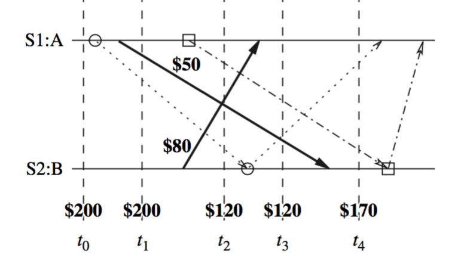
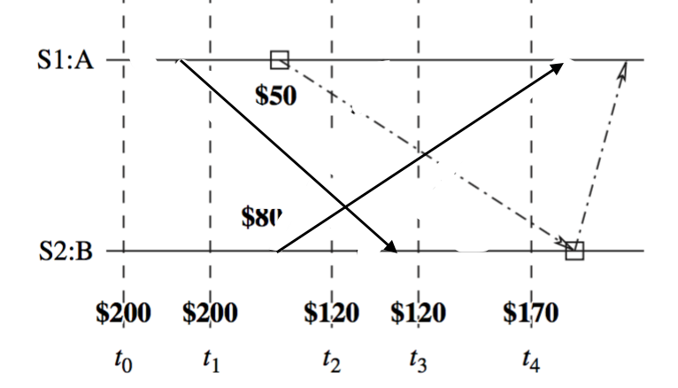

# Global State

Global State $GS$ is $$GS = \{ \cup_i LS_i, \cup_{i, j} SC_{ij} \}$$

$GS$ is consistent iff C1 and C2 are satisfied:

* C1: $send(m_{ij}) \in LS_i \Rightarrow m_{ij} \in SC_{ij} \oplus rec(m_{ij}) \in LS_j$
* C2: $send(m_{ij}) \notin LS_i \Rightarrow m_{ij} \notin SC_{ij} \wedge rec(m_{ij}) \notin LS_j$

Note: $\oplus$ is exclusive-or

Every global state can be graphically represented by a cut in computation's space-time diagram.

Issues in recording a consistent global snapshot of a distributed system.

* I1: How to distinguish between the messages to be recorded in the snapshot (either in a channel state or a process state) from those not to be recorded?
    + Any message that is sent by a process before recording its snapshot, must be recorded in the global snapshot (from C1).
    + Any message that is sent by a process after recording its snapshot, must not be recorded in the global snapshot (from C2).
* How to determine the instant when a process takes its snapshot?
    + A process $p_j$ must record its snapshot before processing a message $m_{ij}$ that was sent by process $p_i$ after recording its snapshot.

## FIFO Snapshot algorithm
### Chandy-Lamport Algorithm
* After a site has recorded its snapshot, it sends a marker along all of its outgoing channels before sending out any more messages
* A process must record its snapshot no later than when it receives a marker on any of its incoming channels.

#### Mark sending rule
1. Process $p_i$ records its state
2. For each outgoing channel $C$ on which a marker has not been sent, $p_i$ sends a marker along $C$ before $p_i$ sends further messages along $C$.

#### Mark receiving rule
On receiving a marker along channel $C$:

* If $p_j$ has not recorded its state
    + Then
        - record the state of $C$ as *the empty set*
        - Execute the "marker sending rule"
    + Else
        + Record the state of $C$ as the set of messages received along $C$ after $p_{j}$'s last state recording and before this marker's receiving.

### Understanding

The text from p96 to p97 is not very self-apparent. I think the topic is about the value of recorded snapshots in such a way.

> Theorem: Exists $seq$'s permutation $seq'$ s.t. the recorded global state  $S^*$ is a middle-stop between $S_i$ and $S_t$, i.e. $S_i \rightarrow_{prefix(seq')} S^* \rightarrow_{seq' - prefix(seq')} S_t$. Here, $seq$ is sequences of events happened globally from $S_i$ to $S_t$.

The idea in this theorem is that, we can permute the order of events to "stretch" the diagram, in which the recorded state is a "real" state.

Definition:

* Pre-recording: A $e$ occurs on a process $p$ and $p$ records its state **after** $e$ in $seq$.
* Post-recording: A $e$ occurs on a process $p$ and $p$ records its state **before** $e$ in $seq$.

This definition is kind of anti-intuitive. "Post" and "pre" should describe the relative ordering of $e$ to recording.

> Theorem: A post-recording event may occur after a pre-recording event only if the two events occur on different processes.

> Theorem: A post-recording event can be swapped with an immediately following pre-recording event in a sequence without affecting the local states of either of the two processes on which the two events occur

For this theorem, a example would be excellent. 

Before swapping:

After swapping:

So you understand that:

*A pre-recording one is made even earlier, while a post-recording one is made later.*

> Proof to first theorem: By iteratively applying the swapping operation, the permutation $seq'$ is obtained. So $S^*$ is the state after all the pre-recording events have been executed, but before any post-recording event.

Therefore, a recorded global state is useful in *detecting stable properties.*

## non-FIFO Snapshot Algorithm
How to capture out-of-sequence messages to record a consistent global snapshot?

* Message Inhibition (Helary et al.)
* Piggybacking of computation messages (Lai-Yang et al.)

### Message Inhibition
After marker is sent, only when a ack for marker is received, will other messages be sent.

### Lai-Yang's Piggybacking algorithm
*A coloring scheme*. Two colors:

* Red
    + Red process: A process having taken a snapshot and going to send markers
    + Red message: A message sent by red process
* White
    + White process: A process not yet taken a snapshot
    + White message: A message sent by white process

> Every white process takes its snapshot at its convenience, but no later than the instant it receives a red message.

Marker informs process $p_j$ of $\{ send(m_{ij}) \,|\, send(m_{ij}) \in LS_i\}$

* Every white process records a history of all white messages sent or received by it along each channel.
* When a process turns red, the marker includes these histories along with its snapshot to the initiator process
* The initiator process evaluates $transit(LS_i, LS_j)$ to compute state of $C_{ij}$

## Snapshots in a causal delivery system

