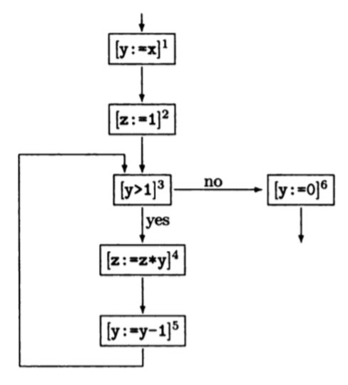

# PPA - Intro
## DFA
### RDA
Reaching Definitions Analysis (or more properly, Reaching Assignment Analysis):

> An assignment (or definition) of form `l: x := a` *may reach* a certain program point if there is an execution of the program where `x` was last assigned a value of `l` when the point is reached.

So, $RD(l) = (RD_{entry}, RD_{exit})$, in which $RD_{entry}$ is the set of pair $(x, l_x)$ means that assignment to $x$ at line $l_x$ may reach $l$'s entry and likely for exit.

Exmaple:

```
1: y := x
2: z := 1
3: while y > 1 do
4:      z := z * y
5:      y := y - 1
6: y := 0
```

$l$|$RD_{entry}(l)$|$RD_{exit}(l)$
---|---------------|--------------
 1 | (x,?), (y,?), (z,?)| (x,?), (y,1), (z,?)
 2 | (x,?), (y,1), (z,?)|(x,?), (y,?), (z,2)
 3 | (x,?), (y,1), (y,5), (z,2), (z,4) | (x,?), (y,1), (y,5), (z,2), (z,4)
 4 | (x,?), (y,1), (y,5), (z,2), (z,4) | (x,?), (y,1), (y,5), (z,4)
 5 | (x,?), (y,1), (y,5), (z,4) | (x,?), (y,5), (z,4)
 6 | (x,?), (y,1), (y,5), (z,2), (z,4) | (x,?), (y,6), (z,2), (z,4) 


### Equational Approach



Based on the flow information, we have two rules:

1. For an assignment `l: x := a`, we exclude all pairs $(x, l_0)$ from $RD_{entry}(l)$ and add $(x, l)$ to obtain $RD_{exit}(l)$; For non-assignment statement at $l$, $RD_{exit}(l) = RD_{entry}(l)$
2. $RD_{entry}(l) = \cup_{i}RD_{exit}(l_i)$, in which $l_i \in$ all the labels from which control *might* pass to $l$; For the first statement, $RD_{entry}(1) = \{(x, ?)\,|\, x \in Var\}$

About *least solution*: The above system can be viewed as a function $F: [RD] \rightarrow [RD]$, which is a iterative process; so we can continue the process until reachability information doesn't change anymore, which is "least solution".

## Constraint Approach
For an assignment `l: z := a`, $$RD_{exit}(l) \supseteq RD_{entry}(l) \setminus \{ (z, l_0) \,|\, l_0 \in \mathbb L\}$$ $$RD_{exit}(l) \supseteq \{ (z, l) \}$$

For non-assignment $l$, $RD_{exit}(l) \supseteq RD_{entry}(l)$

For any $l$, $RD_{entry}(l) \supseteq RD_{exit}(l_x)$ if $l_x$'s control might pass to $l$

And $RD_{entry}(1) \supseteq \{ (x, ?) \,|\, x \in Var\}$

The "least solution" idea also applies to this method.


