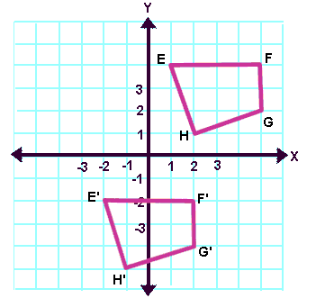
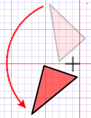
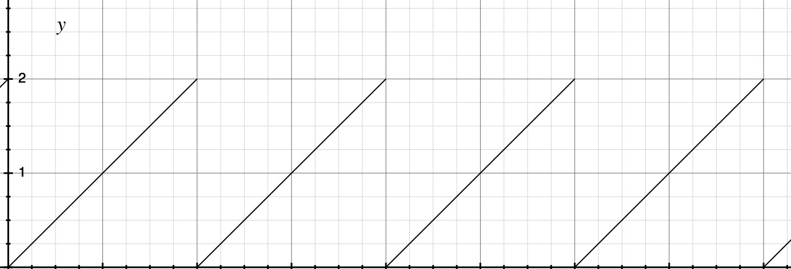
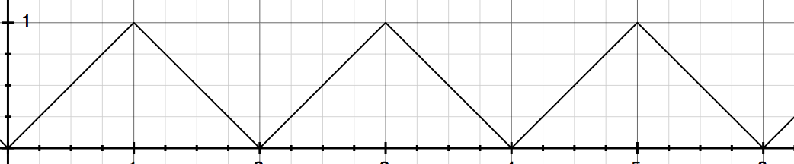

Lesson 2 -- 2D Transformation & Animation
---

In this lesson, we will learn about basic geometrical transformations, like `translate`, `rotate` and `scale`. We will also talk a little bit about its more general form -- *transform matrix*.

Then, we will apply these transformations with the simplest animation technique in `canvas` as practice.

## translate


Like the picture says, translation is moving every point in a same way.  Every point $(x_0, y_0)$ is mapped to $(x_1, y_1)$ such that $x_1 = x_0 + \delta_x$, $y_1 = y_0 + \delta_y$.

So actually, the representation points (like circle center, which is not essential a real point), can also be translated in the same way.

So what retain are the size, shape, as well as *direction*.

## rotate



Rotation is about *around which point* you rotate a shape, and to what *extent*. This is the invariant in transformation. Formally, we define the rotation by a *axis point* and a radian degree, so for every point $(x, y)$ in the original shape, we first translate it to the coordinate where origin is axis, so we got $(x - a_x, y - a_y)$, with it, we transform it to *polar coordinate*, $$ \theta = \arctan(\frac{y - a_y}{x - a_x}) \\ r = \sqrt{(x - a_x)^2 + (y - a_y)^2}$$, so the new point should only differ in $\theta' = \theta + \delta_\theta$, and we reversely transformed $p'$ to the original coordinate.

Actually, rotation can be various. In the 3D world, you can rotate along a line as well.

## scale
scaling is simpler to understand -- just differ in size. But wait a minute, how? well, the intuition is to multiply every component of coordinate of every point by a factor. However, will the *shape* keep? Or, how to define the equivalence between shapes?

Unfortunately, this is a paradox:

> In geometry, two subsets of a Euclidean space have the same shape if one can be transformed to the other by a combination of translations, rotations (together also called rigid transformations), and uniform scalings.

So, we first define the scaling, then we define the equivalence.

## Transform matrix
So, do we have some way to uniform all those different sorts of transformation?

Yes, we have. The answer is matrix.

As long as we represent the shape as collection of point, and point as a vector of coordinates, and all we want is map a point to another point, so a matrix operation is intuitive.

For translate,

$$A = \Big [\begin{matrix}
 		    	1 & 0 & v_x \\
 			   0 & 1 & v_y \\
 			   0 & 0 & 1   
	         \end{matrix}\Big]$$

And the point must be extended to $p = (p_x, p_y, 1)$.

For rotation, let's consider the case when axis is origin

$$A = \Big [\begin{matrix}
				\cos \theta & -\sin\theta \\
				\sin \theta & \cos \theta
			  \end{matrix} \Big]$$

For scaling, it is

$$A = \Big [\begin{matrix}
				v_x & 0 \\
				0 & v_y
			  \end{matrix} \Big]$$

So, ideally, using a $3 \times 3$ matrix, we can represent any primitive transformation, and by the associative property of matrix multiplication, we can get complex transformation by simple multiplying.

## Animation
The idea is simple: Let `draw()` to be a function which will be called every X seconds. And we do a step-based transformation every time. It can be simply $Time \rightarrow Picture$ or $(Picture, \delta_{Time}) \rightarrow Picture'$.

Upon that, we got following program:

```haskell
module Main where

import Prelude
import Control.Monad.Eff.Console
import DOM.Timer
import Graphics.Canvas (getCanvasElementById, getContext2D)
import Graphics.Canvas.Free
import Math hiding (log)
import Data.Maybe
import Control.Monad
import Data.Int (toNumber)

main = do
    mcanvas <- getCanvasElementById "canvas"
    case mcanvas of
        Nothing -> do
            log "failed to load canvas element"
        Just canvas -> do
            let s0 = 400 -- The length of segment
            let r = 100.0 -- original radius of the line
            repeatEvery 100 0 $ \s -> do -- every 100 ms, `s` is current step in integer
                context <- getContext2D canvas
                runGraphics context $ do
                    clear -- clear out the screen
                    setFillStyle "#000000" -- use black

                    -- formula 1
                    let s' = s `mod` s0
                    let x = if s' * 2 > s0 then s0 - s' else s'

                    -- formula 2
                    let theta = (toNumber s' / toNumber s0) * Math.pi
                    let r' = r - ((toNumber s') / 10.0)
                    let lineX = (toNumber x) - (Math.cos theta) * r'
                    let lineY = (Math.sin theta) * r' + 10.0
                    line (toNumber x) 10.0 lineX lineY
						
						-- formula 3
                    let size' = (toNumber s') / 50.0
                    at (toNumber x) 10.0 $ circle (2.0 + size')

-- looper
repeatEvery t s f = do
    _ <- timeout t $ do
        f s
        repeatEvery t (s + 5) f
    return unit

at x y gfx = do
  save
  translate x y
  gfx
  restore

circle size = do
  beginPath
  arc { x: 0.0, y: 0.0, r: size, start: 0.0, end: Math.pi * 2.0 }
  fill

clear = do
    setFillStyle "#FFFFFF"
    rect {x: 0.0, y: 0.0, h: 400.0, w: 400.0 }
    fill

line x0 y0 x1 y1 = do
    beginPath
    moveTo x0 y0
    lineTo x1 y1
    stroke
```

There are three important formulas, determining the system state:

### Formula 1
The changing of $s'$ with $s$ is like 

Thus, The changing of $x$ with $s$ is 


### Formula 2
This does two things: fix one end to the circle, and another end rotate around the circle with a $\theta$ changing with $s$. And also, the length of $r$ will change.

### Formula 3
Two things: scaling and translating.


