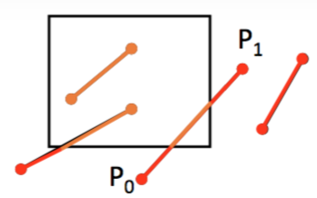

Lesson 3 -- Compositing, Clipping and Texturing
---

In this lesson, we will learn:

* Compositing: Deal with overlapping of shapes
* Clipping: Mask out unwanted part
* Texturing: Use existing image as background of shape

Actually, these three functionalities are very common in image processing.

## Compositing
Alpha channel is a channel beyond RGB, and it specifies the mixing of background and object. How do we express that a pixel is half covered by a full real object? We can assign a alpha = 0.5 to the pixel. The quadruple $(r, g, b, \alpha)$ indicated that the pixel $\alpha$-covered by the color $(r/\alpha, g/\alpha, b/\alpha)$.

So, what does it mean when $\alpha = 0$? It means full transparency.

### The algebra of compositing
If $\alpha_A$ and $\alpha_B$ represent the opaqueness of semi-transparent objects which fully cover the pixel, then each object lets $1 - \alpha$ of the background through. So the left background is $(1 - \alpha_A)(1 - \alpha_B)$ of the pixel. And $\alpha_A(1- \alpha_B)$ of the background is blocked by object A, while $\alpha_B(1- \alpha_A)$ of the background is blocked by object B. So the total blocked background is $1 - (1 - \alpha_A)(1 - \alpha_B) - \alpha_A(1- \alpha_B) - \alpha_B(1- \alpha_A) = \alpha_A\alpha_B$

Thus, we have the following table:

|name|description|area|
|----|-----------|----|
| 0  | $\bar A \cap \bar B$ | $(1 - \alpha_A)(1 - \alpha_B)$ |
| A  | $A \cap \bar B$ | $\alpha_A(1 - \alpha_B)$ |
| B  | $\bar A \cap B$ | $(1 - \alpha_A)\alpha_B$ |
| AB |$A \cap B$ | $\alpha_A\alpha_B$ |

* Composite Table
A binary compositing operation can be identified as a quadruple indicating the input picture which contributes to the composite the input picture which contributes to the composite in each of the four sub-pixel areas 0, A, B, AB.

In AB area, the composited result could be of 3 cases, in A (B) area, 2 cases (original or nothing), and only the nothing case in 0 area. So in total, there are 3 * 2 * 2 * 1 kinds of composites in the following table. Worth noting is that, the diagram is not composed result, but just a set theory abstraction illustrating the composing. Don't get it wrong!


References:

* https://en.wikipedia.org/wiki/Alpha_compositing
* http://keithp.com/~keithp/porterduff/p253-porter.pdf
* http://www.cs.princeton.edu/courses/archive/fall00/cs426/papers/smith95a.pdf


## Clipping
This is a easy concept. You don't want to draw things everywhere, but using a mask, which essentially is another polygon, to clip the unwanted region away.

But let's take a more computational view into this. First, you certainly don't want to draw everything first, then selectively put then on screen. It would be a huge waste of computation power if only a tiny section is clipped. Instead, we'd like to compute, for the primitive shapes, how to turn them into clipped ones before doing rendering at all. Further more, if we are doing the "complete overlapping" in the compositing, we might also want to take a more efficient approach.

And for simplicity of discussion, we will only consider the clip window as a 2D rectangle, determined by $(rx_0, ry_0), (rx_0, ry_1), (rx_1, ry_0), (rx_1, ry_1)$, where $rx_0 < rx_1, ry_0 < ry_1$

### Clipping points
Say we have points $(x_i, y_i)$, apparently, only when $rx_0 \le x_i \le rx_1$ and $ry_0 \le y_i \le ry_1$, will the point be in the region.

### Clipping segments
Say there is a segment $(x_0, y_0)$ to $(x_1, y_1)$, we'd like to know if there any part of the segment lying inside the region, and if yes, which part (another segment).



First, intuitively,

1. If all endpoints lie in the region, the segment is;
2. If one endpoint is in and another is out, part of segment is;
3. If none of endpoints is in, segment *might* have some part in region

The second case can be solved by finding the intersection point. By splitting the outer region into 8 areas, we can reduce the average trails we need.

The same idea can be applied in solving third case as well.


Say code for endpoints are $C_0$ and $C_1$, then

* If `C_0 | C_1 == 0000`, completely in
* If `C_0 & C_1 != 0000`, completely out

For the other cases, you might still need to calculate the intersection points.

For clipping polygon, we have [Sutherland-Hodgman algorithm](https://en.wikipedia.org/wiki/Sutherland–Hodgman_algorithm). But this will be not discussed here.


## Texturing
Texture is a very common concept in graphics. It is mostly used to "cheat" the viewer. It is intensively used in highly interactive and real-time graphical applications -- i.e., video games.

For example, most buildings in computer game is simple a box, with no more than 10 facets. But they are textures with brick wall picture et cetera, looking as if it has a complex geometry.

And in 2D world, we can use image to replace the complex combination of primitive shapes. This can be both realistic and economic. The disadvantage is that texture is not flexible enough.

The basic problem in texturing is *mapping*, from texture space to object surface space. This can be complex. Image that you are mapping a rectangle 2D texture to a 3D sphere. Apparently, the "upper edge" would be squeezed into a polar, ten pixels become one. So we need a way to compose, to "stretch" the pixels.

## Practice
Finally, we come here. Our project would be much easier compared to the theory. We will texture some rectangles, clip them, then composite them.

```haskell
withImage "resource/copycat.jpeg" $ \img -> do
    context <- getContext2D canvas
    runGraphics context $ do
        save
        beginPath
        arc { x: 120.0, y: 70.0, r: 60.0, start: 0.0, end: Math.pi * 2.0 }
        closePath
        clip
        drawImage img 0.0 0.0
        restore
        setComposite Lighter
        setFillStyle "#FF0000"
        beginPath
        arc { x: 200.0, y: 140.0, r: 30.0, start: 0.0, end: Math.pi * 2.0 }
        fill
        setFillStyle "#0000FF"
        beginPath
        arc { x: 210.0, y: 150.0, r: 30.0, start: 0.0, end: Math.pi * 2.0 }
        fill
```

The actual code is very simple. We have two contexts, so I `save` and `restore` here. In the first context, I clip the copy cat with a adorable circle; and in the second context, I mixed blue and red with `Lighter` composite and got a pink intersection.

For more about composite, go [here](https://developer.mozilla.org/en-US/docs/Web/API/Canvas_API/Tutorial/Compositing/Example).


