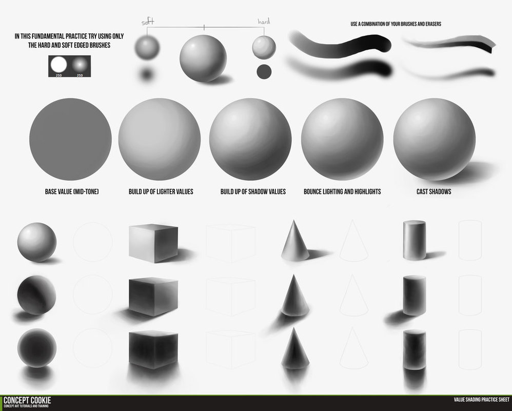
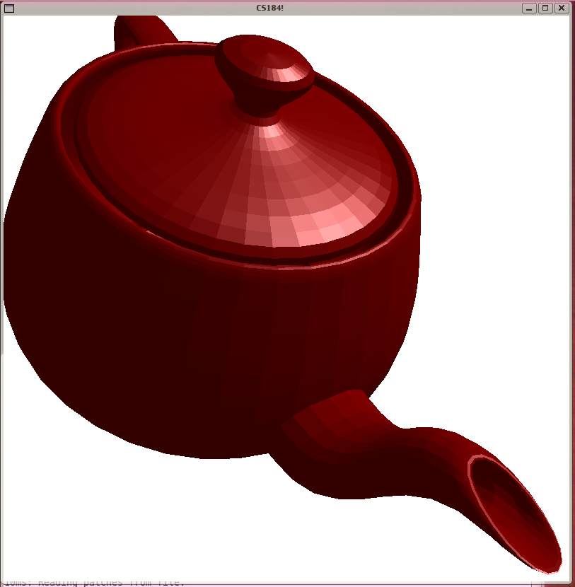

Lesson 4 -- WebGL the essentials
----

## Foreword

From this lesson on, we will use WebGL interfaces instead of Canvas API. In summary, WebGL uses hardware acceleration to achieve high performance, and is very powerful due to high customizability, but also a lot more complex to use compared to Canvas API.

In the graphics course I took, we use raw JavaScript to write WebGL program, which is proved to be a grinding experience, even to implement the simplest function. Actually, people use JS library like [three.js](http://threejs.org) to write the so-called WebGL program. PureScript also got its own [bindings](https://github.com/anthoq88/purescript-three) for this JS library. However, we are learning Graphics *rather than using it for production*, so I will use PureScript to write raw WebGL demo programs. Some abstraction is necessary, but I want to highlight the *data flow* of rendering. Also, we will program shaders with PureScript by ourselves. Despite all that, using PureScript can still eliminate a lot of stupid errors you might make in JS :P. In the final end, we will try some simple three.js programming in PureScript.

## WebGL
The "GL" in WebGL means "Graphics Library". It is actually based on OpenGL ES 2.0, or a JavaScript API for OpenGL implementation.

The mainstream browsers all supports it, but your computer's GPU is another important factor. Check out [this page](http://www.doesmybrowsersupportwebgl.com) to see your browser's case.

It is mainly used to render 3D graphics, although 2D is possible. But 3D renderings requires much more computation and that is why we use hardware acceleration and shader API.

The central concept of WebGL programming is *shader*, or *shading*. It is rather technical and hardware relevant, but let's see what it is on earth.

### Shading

> Shading refers to depicting depth perception in 3D models or illustrations by varying levels of darkness.

Well, ok, you mean **shade**? I know what is "shade"! It is something similar to shadow.

Hmm .... Not very relevant ...

What about this?

It come closer. So first, there will be light. And maybe the viewpoint is also taken into the consideration. And the object should be 3D.

This is the **shading** in computer graphics ... Can you tell what it does?

Well, there is color. And, there is some segments on the surface, so maybe the input is just a 3D frame of limited points, and the points are interpolated into little segments of surface. And the teapot "looks real", because there is *perspective*.

### Shader
1. Shader is a *program*
2. Shaders are mostly run on GPU (Graphics Processing Unit)
3. Shader is used to render *effect*
4. Shader can be programmed and loaded on demand

Now, forget about the guessing, let see some concrete examples:

* How many sorts of them? Geometry shaders, vertex shaders, fragment (pixel) shaders
* Vertex shaders calculated the traits of a vertex, like position, texture position (where its correspondence is on texture), colors
* Fragment shaders calculated the traits of a fragment (pixel) of surface, like color, z-depth, alpha value et cetera
* Geometry shaders calculated the "real geometry" from "control geometry". Just for example, given the centre point and radius, the shader can output an array of 3D points (or triangles) as a frame of a sphere, given the generation complexity (more points or less points).

Even more concretely, in WebGL, a shader is a piece of text, which will be compiled and loaded into your GPU. The text can be specified as a DOM object (`<script id="shader-vs" type="x-shader/x-vertex">`), or simply as a JS string object.

#### Further readings:

* https://en.wikipedia.org/wiki/Shading
* https://en.wikipedia.org/wiki/Shader

## Graphics Pipeline
So, where did the complexity of WebGL come from? It comes from the underlying mechanism -- GPU graphics pipeline. If you are familiar with computer architecture, you will understand how pipelining can accelerate the computation, as well as how erroneous and inefficient it can be when the generated low-level code is simply terrible.

So, you can view the pipeline as a non-stopping, complex, huge, powerful and speedy machine. ONCE you drop data into it, it will run like crazy in the most efficient way. So in order to make things work well, it is essential to understand the graphics pipeline.

Further reading: [Graphics Pipeline](https://en.wikipedia.org/wiki/Graphics_pipeline)

