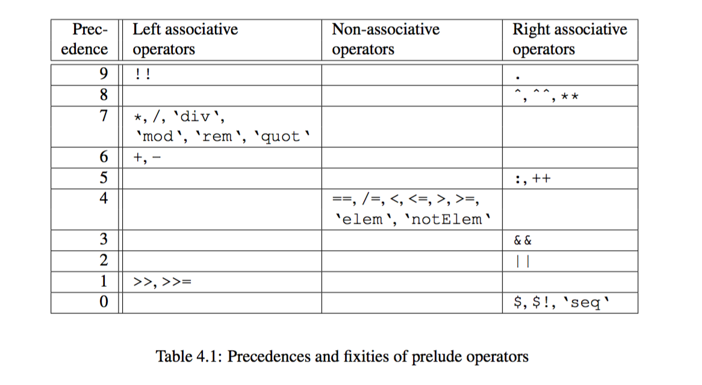

`Operators`
----

> This module implements the desugaring pass which reapplies binary operators based on their fixity data and removes explicit parentheses.

First, every binary operator $op$ has two attributes, associativity  and priority.

This picture is from Haskell 2010 report.

The dilemma to solve is for sub-expression $a \, op_1 \, b \, op_2 \, c$, how should we group it?

If $op_1$ is larger than $op_2$ in priority, $(a \, op_1 \, b)$ is preferred as first group.

If they have same priority, then *they are supposed to be of compatible direction of association*. For example, the shared direction is left, then $(a \, op_1 \, b)$ is preferred as first group.

Next, the operator section.

This is about `(+ 1)` or `(1 +)` etc. We simply make them into proper abstraction.

